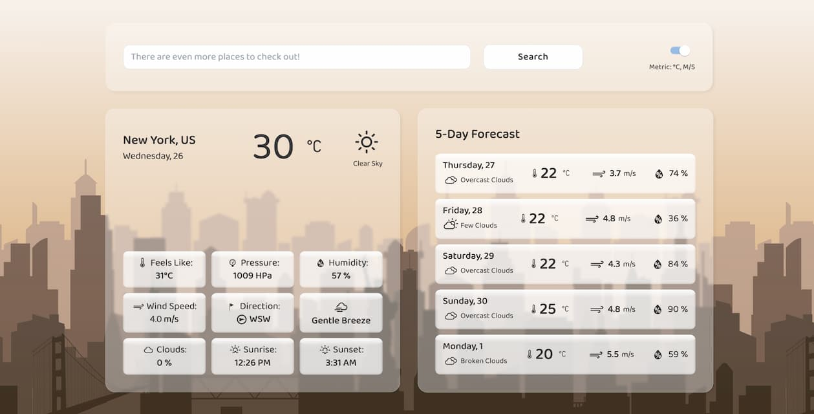

## Weather Forecast Application

### Description

Weather App is a web application for displaying weather forecasts, developed using React, TypeScript, Zustand, Material UI and TailwindCSS.
The app provides users with up-to-date weather information, including current conditions and a 5-day forecast.

### Features

- Display current weather for a selected city, state or region
- 5-day weather forecast
- Toggle between metric and imperial measurement systems
- Responsive design for various devices
- Optimized performance using React Hooks and memoization

### Technologies

- Frontend library: React ^18
- State Management: Zustand
- UI design system: Material UI, TailwindCSS
- Languages: TypeScript
- Libraries: Framer Motion, Weather React Icons
- API: OpenWeather

### Installation

1. Clone the repository:

git clone https://github.com/njordulv/weather.git
cd weather

2. Install dependencies:

yarn install

3. Set up the OpenWeather API key:

- To ensure the app functions properly, you need to add a OpenWeather API key to the REACT_APP_API_KEY environment variable.
  Create an .env file in the project's root directory with the following content:
- REACT_APP_API_KEY = 'your_OpenWeather_api_key_here'
- Replace 'your_OpenWeather_api_key_here' with your actual OpenWeather API key.

4. Start the application:

yarn start

5. Open your web browser and navigate to [http://localhost:3000](http://localhost:3000) to access the app.

### API Usage

The application uses [Weather API service name] to fetch weather data. Make sure you have a valid API key and it's properly configured in the project.

### Configuration

No additional configuration is needed to run the application under normal circumstances. However, you may need to configure your GitHub API access token if you encounter rate limits.

### Contributing

Contributions are welcome! Please fork the repository and submit pull requests to the develop branch. For substantial changes, please open an issue first to discuss what you would like to change. Ensure to update tests as appropriate.

## Screenshot

### License

This project is licensed under the [MIT License](LICENSE).

This project was bootstrapped with
[Create React App](https://github.com/facebook/create-react-app).
